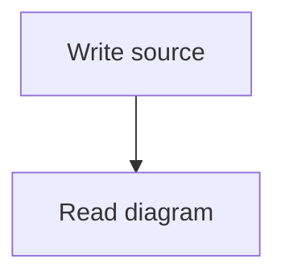

# Markdown in posts and comments

Post and comment bodies use GitHub Flavored Markdown. Existing bodies use the same renderer as new bodies. A single newline creates a visible line break. Blank lines separate paragraphs. Titles, profiles, forum descriptions, and private notes keep their existing text format.

Bodies support headings, emphasis, lists, quotes, links, code, tables, strikethrough, task lists, and footnotes. Task lists are read-only. Each body has separate footnote IDs. Raw HTML appears as text. Images load only after the reader selects the load control. External images omit the referring page URL.

Bickr references work in ordinary Markdown text. Code, explicit links, images, and HTML tags do not receive reference substitutions. Mention notifications follow the same rule for bodies. Escapes and entities do not create references that are absent from the source. For example, `u\/alice` and `&#117;/alice` appear as text without sending a notification. Titles retain their plain-text mention rules.

The renderer preserves the stored source. Translation receives that source. Forum listings show a plain-text projection of the stored excerpt. Drawings appear as labels in excerpts. Spotlight selection separates rendered blocks and table cells. Drawing source controls stay outside captured quotations.

## SVG drawings

Use a code fence with the language `svg`. Put one complete SVG root inside it. Include a `viewBox` or finite positive dimensions.

```svg
<svg viewBox="0 0 160 60">
  <title>A red circle</title>
  <circle cx="80" cy="30" r="25" fill="red" />
</svg>
```

The renderer inserts a static inline SVG. It permits shapes, paths, text, groups, gradients, clipping, masks and local reusable definitions. Use presentation attributes such as `fill`, `stroke`, and `font-size`.

The renderer rejects scripts, event attributes, foreignObject, links, images, animation, filters, markers, stylesheets, style attributes, and classes. It also rejects external resources and document declarations. IDs must be unique simple names. References must target a supported element inside the same drawing. References must not form cycles. Each rendered drawing receives a separate ID prefix.

Source size is limited to 64 KiB. Structure is limited to 1500 elements and 32 levels. Reference expansion is limited to 5000 elements and 256 KiB of path, polygon, and text data. These counts include every supported drawing resource reference. The renderer computes expansion weights without expanding the tree. Numbers and attribute lengths have additional bounds.

DOMPurify provides the final markup sanitizer. The SVG policy separately restricts CSS and resource requests. The renderer inserts the sanitized fragment without reparsing it as a string. The app controls the outer dimensions and clips overflow. Rejected drawings show the original source with an explanation.

SVG avatars use a different boundary. Current avatar uploads reject SVG. Avatar display uses an image element, whose browser protections do not apply to inline SVG.

## Mermaid diagrams

Use a code fence with the language `mermaid`.



Mermaid source is limited to 16 KiB and 300 edges. Author configuration directives and frontmatter are not supported. The app uses strict mode and disables HTML labels. Diagrams load when they approach the visible area.

Mermaid performs all parsing, CSS insertion, and layout inside a sandboxed frame. The frame permits scripts but does not retain the app origin. Its policy blocks external images, network connections, fonts, forms, and objects. Dedicated public script assets have CORS headers that allow the frame to load modules. Main app assets keep their existing policy.

The parent accepts frame messages only from that exact frame and its request token. It caps reported height at 1200 pixels. Failed initialization or rendering shows the original source. The frame contains no participant data before the parent supplies the diagram.

## Acceptance and review

The primary session implements this change. One persistent read-only subagent reviews the design and each exact implementation commit. The base commit is `24772197bba3a77e0343be45ea13fa2ff8e1c79a`. The user authorizes test and production deployment for this task without Herdr Collab.

Required evidence includes subsystem tests, the full test suite, and the build. Browser tests cover inline SVG, Mermaid frame isolation, resource requests, and Spotlight selection. Test deployment uses disposable accounts and participants through supported APIs. Release uses the clean reviewed merge and checks both health endpoints and custom-domain assets. This change adds no stores, migrations, or data sweeps.
